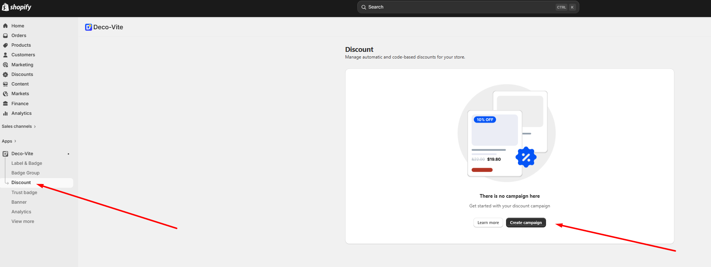

# 🛒 DECO Discounts

## **What are DECO Discounts?**&#x20;

**DECO Discounts** are built-in marketing tools that allow merchants to highlight price reductions directly on products. They can display various discount types, such as percentage off, fixed savings or even new prices, across specific products, collections, or your entire store to attract attention and boost conversions.

## ✅ Preparations

Before starting, you just need:

* [x] DECO Plan: Starter/Growth/Unlimited

## ✨Step-by-step Setup

First, let's go to Discount here:&#x20;

<figure><figcaption></figcaption></figure>

We'll walk through two **features:**&#x20;

1. _Automatic Discount_&#x20;
2. _Discount Code_&#x20;

<figure><figcaption></figcaption></figure>

###
