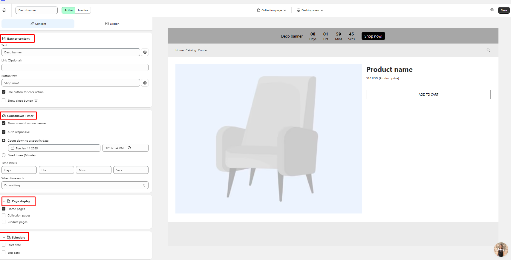
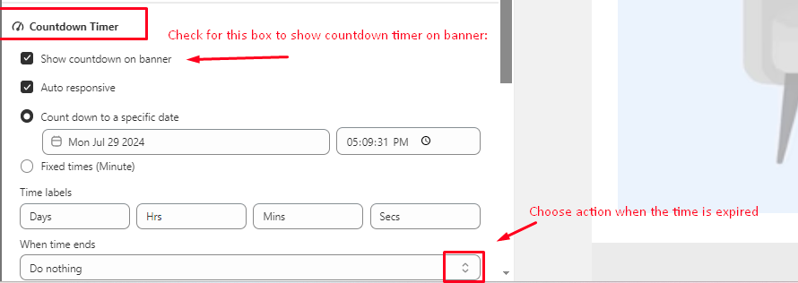
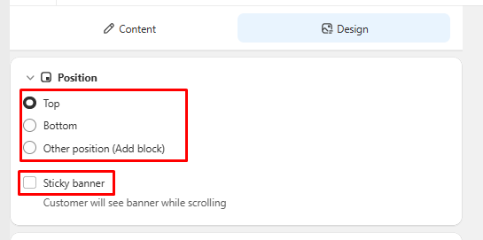

# 🎯 DECO Product Banners


**DECO Banner:** Notification bars, which **HANG ON THE TOP/BOTTOM/ CUSTOM POSTION** of your page(s) to notify **SALE** campaigns, **special deals** or to **highlight important information** about website.


<figure><figcaption></figcaption></figure>

<figure><figcaption></figcaption></figure>

### What are DECO banner types I can select?

* After hitting on "Create banner"/"Create", select 1 of banner types here to start:

<figure><figcaption></figcaption></figure>

### How can I create my banner?

* You will need to **go through 2 steps**: **Content** > **Design**

<figure><figcaption></figcaption></figure>

## Step 1: Content

* Here is where you can **choose** which **basic look** for your banner: Banner content, Pages to display, and Time to display
* Depending on which kinds of DECO Banner you selected, it'll have the different look on "Content" section

### 1. Fixed banner

* Banner _**won't move,**_ the text inside will stay still

<figure><figcaption></figcaption></figure>

### 2. Automatic banner

* The content inside will _**keep moving horizontally**_ based on the duration you set up

<figure><figcaption></figcaption></figure>

### 3. Slider banner

* The content will _**slide vertically or horizontally**_ with the duration as you chose, you also can **choose to show "x" button** and **"arrow" button** or **not.**

<figure><figcaption></figcaption></figure>

### 4. Countdown banner

* This is a banner type to be used when you want to create a sense of urgency for customers, especially for sale campaign, or big events.

<figure><figcaption></figcaption></figure>


"**Countdown timer**" for "**Fixed banner"** only: You can adjust the time for this countdown timer, then also choose action when the time is expired:&#x20;

* **Do nothing** (Banner still display on your store)&#x20;
* **Hide banner** (Banner will stop showing up on your store)


<figure><figcaption></figcaption></figure>

## Step 2: Design

### Position

* You can choose the position of your banner at: **Top page, Bottom page or Customized position**


**Note:** You can tick **"Sticky banner"** if you want your banner **still be visible when you scroll through your pages**


<figure><figcaption></figcaption></figure>

How can I add my banner to customed position?

Here is the detail video for you:&#x20;



### Banner design

* You can custom color for your banner, text, close button
* Here, you can also **custom banner size/ banner text size differently** on **desktop/ mobile** OR between **Product page and collection page**

<figure><figcaption></figcaption></figure>

<figure><figcaption></figcaption></figure>

### Button

* If you enable "Call to action" button(CTA button), you can customize its color, size, etc here:

<figure><figcaption></figcaption></figure>
