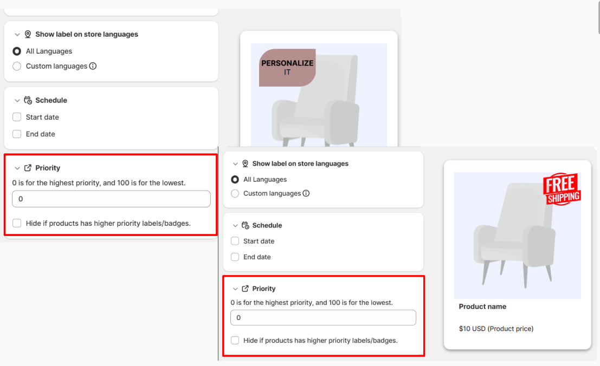
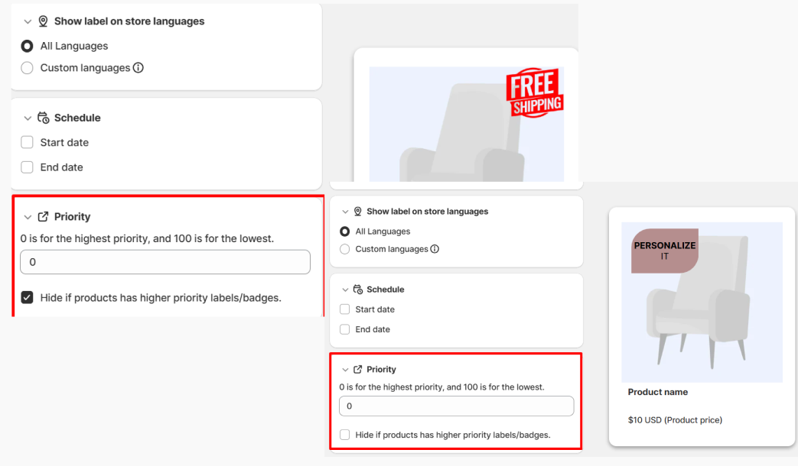

# 🌟 Priority

## ✨ How "Priority" Can Help Control Badge Visibility?

### ✔️ Understanding Badge Priority & Visibility

* The Priority setting gives you precise _<mark style="color:$primary;">**control over which badges appear**</mark>_ on a product _<mark style="color:$primary;">**when multiple display conditions are met**</mark>_ simultaneously.&#x20;

⇒ This prevents your product images from becoming cluttered and _<mark style="color:$primary;">**ensures your most important marketing messages**</mark>_ stand out!

### ✔️ The Priority Scale

The system uses a numerical ranking to determine importance:

* _<mark style="color:$primary;">**0**</mark>_ is the _<mark style="color:$primary;">**Highest Priority**</mark>_ (appears first/takes precedence).
* Larger numbers (_<mark style="color:$primary;">**1, 2, 3**</mark>_...) represent _<mark style="color:$primary;">**Lower Priority**</mark>_.

### ✔️ Key Feature: "Hide if product has higher priority badges"

* Each badge has a checkbox labeled "Hide if product has higher priority badges."&#x20;

⇒ This setting _<mark style="color:$primary;">**determines if a badge should disappear**</mark>_ when it "competes" with a more important one.

## ✨ How Priority Logic Works

### 1. Badge With Different Priorities

⇒ If _<mark style="color:$primary;">**two badges have different priority numbers**</mark>_, the system looks at the _<mark style="color:$primary;">**"Hide..." checkbox**</mark>_ of the lower-priority badge.

* <mark style="color:$primary;">**If both checked**</mark>: The lower-priority badge will be hidden.
* <mark style="color:$primary;">**If both unchecked**</mark>: Both badges will be displayed (unless the higher-priority badge also has a "Hide" rule).

> Example:
>
> * Badge A: "Free Shipping" | Priority: 0 | "Hide..." box: Unchecked.
> * Badge B: "Personalize It" | Priority: 1 | "Hide..." box: Checked.
> * Result: Only "Free Shipping" is displayed because Badge B is set to hide whenever a higher priority (0) is present.

<figure><figcaption></figcaption></figure>

### 2. Badges with the Same Priority

| <mark style="color:$primary;">**Scenario**</mark> | <mark style="color:$primary;">**Behavior**</mark>      | <mark style="color:$primary;">**Result**</mark> |
| ------------------------------------------------- | ------------------------------------------------------ | ----------------------------------------------- |
| Both have "Hide" checked                          | The older badge (created first) wins.                  | Only the first-created badge shows.             |
| Neither has "Hide" checked                        | No hiding rules are triggered.                         | Both badges are displayed.                      |
| Only one has "Hide" checked                       | The "Hide" rule only triggers for _higher_ priorities. | Both badges are displayed.                      |

Example: _<mark style="color:$primary;">**Both have "Hide..." checked**</mark>_

* Badge A: "New Arrival" (Created June 17). Priority: 0. "Hide" Checked.
* Badge B: "Pre-order" (Created June 20). Priority: 0. "Hide" Checked.

⇒ **Result:** "New Arrival" is displayed because it was created first.

Example: _<mark style="color:$primary;">**Neither has "Hide..." checked**</mark>_

**⇒ Result:** Both badges display

<figure><figcaption></figcaption></figure>

Exampl&#x65;**:&#x20;**_<mark style="color:$primary;">**Only one has "Hide..." checked**</mark>_

**⇒** **Result:** Both badges display

* The "Hide..." setting only works when comparing badges with _different_ priorities

<figure><figcaption></figcaption></figure>

#### 3. Summary Table&#x20;

| **Priority Level** | **Hide Box Status** | **Outcome**                              |
| ------------------ | ------------------- | ---------------------------------------- |
| Highest (0)        | N/A                 | Always displays.                         |
| Lower (1+)         | Checked             | Hidden if a Priority 0 badge exists.     |
| Lower (1+)         | Unchecked           | Displays alongside the Priority 0 badge. |
