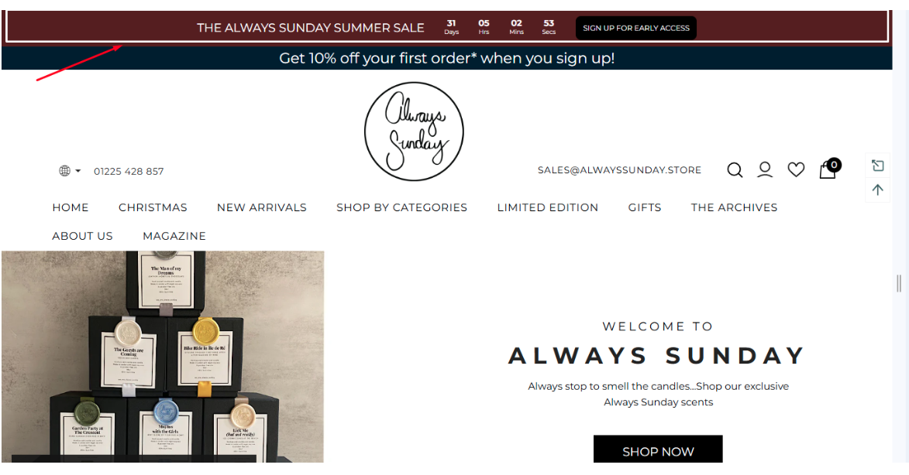
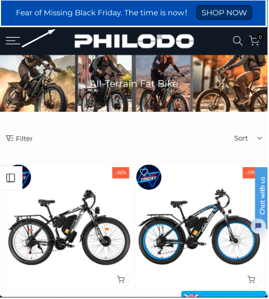
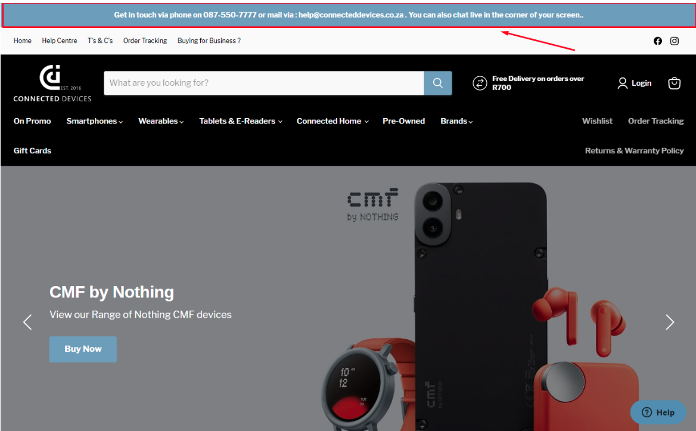

# 🪁 Skyrocket Conversion Rate with DECO Banner Bars! ✨

## Boosting Sales and Engagement with DECO’s Banner Bars: Real Results from Real Merchants

**Overview**

DECO users reported that they saw a 20% growth in conversion rates simply by using banner bars.

**Why Banner Bars is a must-have?**

These bars might look simple, but they’re actually powerful tools by creating urgency, driving action, and delivering key messages. Let’s see how our merchants are using DECO banner bars to turn visits into sales:

## **Case Study 1:** **Urgency that Sells – Turning Visitors into Buyers**

As a seller, do you often come across this situation?  A customer lands on your store, scrolls through your products, and maybe even adds a few to their cart. They’re interested—but then, life happens. They click away, and suddenly, your potential sale is gone.

There, it’s the perfect time to use DECO banner bars: Create Urgency.&#x20;

* Setting up a countdown timer that ticks down on limited-time offers, pushing visitors to act fast.&#x20;
* And it’s not just about the timer—these bars are fully customizable to fit your brand. Want to make it pop with your signature colors and fonts? You got it.

**Result**: With a countdown ticking away at the top of the page, customers feel the nudge they need to complete the sale, helping merchants capture what could have been missed revenue.

**Example:**&#x20;

1 of our merchants – **“Always Sunday”** to boost their customer’s engagement, placed a countdown timer on their “Summer Sale” banner, encouraging customers to sign up and access exclusive deals, resulting in a list of customers interested in those products, and of course getting more sales.

 

<figure><figcaption></figcaption></figure>

## **Case Study 2: Getting Customers to Take Action – One Click, Big Impact**

Sometimes, it’s all about guiding your visitors in the right direction. That’s where a strong call-to-action (CTA) comes in, and DECO banner bars make it easy to add one.&#x20;

* With a simple message and a clear link, you can direct customers exactly where you want them—whether it’s to a hot sale collection, a limited-time sale, or a newsletter sign-up.
* Our merchants find that placing a CTA in a highly visible banner at the top or bottom of the page is an effective way to keep visitors engaged and get them to act.&#x20;
* And with scheduling options, you can choose exactly when and where the banner appears, so it always hits at the right moment.

**Result**: From more sign-ups to higher click-throughs, DECO banner bars help Shopify merchants make every visit count by guiding customers toward meaningful actions.

**Example:**&#x20;

Another  merchant – **“PHILODO”** added a “Shop Now” CTA linking to their Black Friday deals, leading to higher click-throughs and, ultimately, more sales.

<figure><figcaption></figcaption></figure>

## **Case Study 3: Delivering Can’t-Miss Announcements**

* When it’s time to communicate essential updates, DECO banner bars are front and center. Merchants use them for shipping alerts, holiday hours, or policy updates, ensuring customers stay informed.

**Result:** By using banner bars for must-know updates, merchants keep customers informed and set expectations, leading to fewer questions and a smoother shopping experience.

**Example:** Our merchant **“Connected Devices**” used a top-page banner to highlight key store information, creating a smoother shopping experience for all.

<figure><figcaption></figcaption></figure>

## **Why DECO Banner Bars?**

* With DECO, it’s more than just a banner—it’s a smart strategy.&#x20;

DECO makes it super easy to customize your message, add a countdown, schedule the display, and guide visitors to action. Ready to make your message matter? Try DECO banner bars today and watch your conversions grow!!
